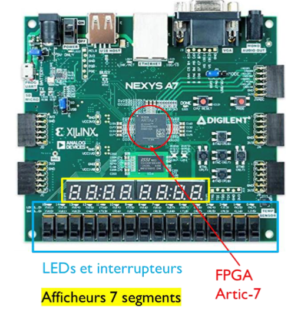

# Digital Chronometer VHDL

> A complete digital chronometer project developed in VHDL, designed and implemented on the **Nexys A7** FPGA board

## Overview

This project implements a complete digital chronometer capable of measuring time up to **59:59.9** (59 minutes, 59 seconds and 9 tenths of a second). Entirely developed in VHDL, it demonstrates the fundamental principles of digital design and FPGA programming.

### Main Features

- **Dynamic Display** : 7-segment display in real-time via the 4 anodes of the Nexys A7
- **User Control** : 
  - Start/Stop via switch
  - Reset via button
  - Acceleration mode
- **Visual Indicators** : LED rotating pattern for visualizing tenths
- **Counter Cascading** : Modular architecture with reusable counters


## Project Architecture

```
VHDL-chronometer/
├── Chronometre.vhd          # Top-level entity
├── Chronometre_tb.vhd       # Main testbench
├── Affichage/               # 7-segment display module
│   ├── Affichage.vhd
│   ├── Affichage_tb.vhd
│   ├── Counter_2b/
│   ├── Mux_4x1x4b/
│   ├── Transcodeur_7seg/
│   └── Transcodeur_anodes/
├── Compteur/                # Counting modules
│   ├── COUNTER_DIXIEME_MIN_SEC/
│   ├── Counter_dixieme_RE/
│   ├── Counter_Diz_4b_RE/
│   └── Counter_Unit_4b_RE/
├── Gestion Horloge/         # Clock generators
│   ├── CLK_OUT_AFF/
│   └── CLK_OUT_COUNT/
└── VIVADO-Project/          # Xilinx Vivado Project
    └── Chronometre/
```

### Main Modules

#### **Chronometre.vhd** (Top-level)
The main entity that orchestrates all modules :

**Inputs :**
- `CLK` : Board clock (100 MHz)
- `SEL_SPEED_CLK` : Switch for counting acceleration
- `START_STOP` : Start/stop switch
- `RESET` : Reset button

**Outputs :**
- `AFF[6:0]` : 7-segment segments (active low)
- `ANODES[3:0]` : Anode selection (active low)
- `LED_OUT[9:0]` : LED rotating pattern (tenths)
- `TC` : Terminal Count (end of 59:59.9 signal)

#### **Clock Management**
Two independent clock generators :
- `CLK_OUT_COUNT` : Clock for counters (1 Hz or accelerated)
- `CLK_OUT_AFF` : Clock for 7-segment display (~1 kHz)

#### **Counter**
Four cascaded counters :
1. **Tenths** : 0-9 tenths of a second
2. **Units of seconds** : 0-9 seconds
3. **Tens of seconds** : 0-5 (for 0-59 seconds)
4. **Minutes** : Cascaded counting for 0-59 minutes

#### **Display**
Dynamic display module with :
- `Transcodeur_7seg` : BCD to 7-segment code conversion
- `Transcodeur_anodes` : Active anode selection
- `Mux_4x1x4b` : 4-to-1 multiplexer (4 bits)
- `Counter_2b` : 2-bit counter for anode rotation


## Chronometer Usage

| Control | Action |
|---------|--------|
| `START_STOP` | Starts/stops the counting |
| `RESET` | Resets the chronometer to 00:00.0 |
| `SEL_SPEED_CLK` | Activates acceleration mode (testing) |
| 7-seg display | Displays MM:SS.D (minutes:seconds.tenths) |
| LEDs | Rotating pattern for tenths |


## Hardware Implementation

<div align="center">



**Nexys A7 Board** — *Artix-7 FPGA • 100 MHz • 4 × 7-Segment Displays*

</div>


## 🧪 Testing & Verification

Each module comes with an associated testbench :

- `Chronometre_tb.vhd` : Test of the complete system
- `Affichage_tb.vhd` : Test of the display module
- `COUNTER_DIXIEME_MIN_SEC_tb.vhd` : Test of counters
- `tb_counteurdixieme.vhd` : Test of tenths counter
- `tb_unit_second.vhd` : Test of units seconds counter
- `tb_dizaine_sec.vhd` : Test of tens seconds counter


---


## Authors

- **Paul Ledrapier**
- **Liam Morineau**
- **Titouan Bocquet**
- **Bosco de Rauglaudre**
